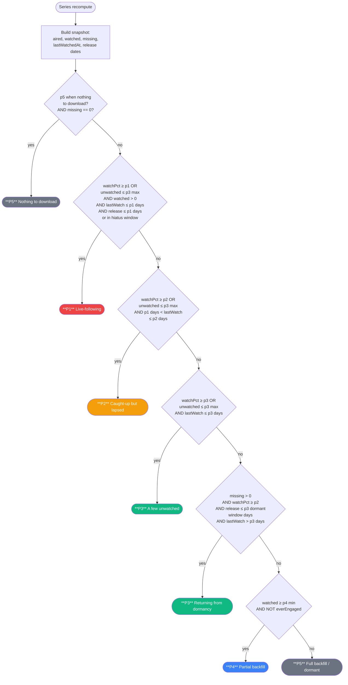

# Prioritarr

Priority-aware download orchestrator for the Sonarr / qBittorrent / SABnzbd / Plex / Trakt stack.

Sonarr downloads *everything*. Prioritarr asks the question Sonarr doesn't — **which downloads should I focus on first?** — and enforces the answer by pausing, boosting, demoting, and cleaning up downloads, searching for missing episodes in priority order, syncing watch state across your sources, and reaping orphan files.

---

## What prioritarr does

- **Classifies every series into P1–P5** based on your actual watch behaviour across Plex + Tautulli + Trakt.
- **Enforces those priorities in qBittorrent and SABnzbd** — P1 downloads first, P4/P5 paused while P1 is in flight.
- **Runs priority-ordered missing-episode searches** so Sonarr fetches what you'll watch next, not what it sees first.
- **Detects stale / failed downloads and cleans them up**, re-queuing a fresh search in priority order.
- **Mirrors watch state between Plex and Trakt** so both sides always agree.
- **Reaps orphan files in the download folder** — deletes safe ones (already hardlinked into the library), triggers Sonarr to import the ones that were missed, surfaces the rest for manual review with rename / re-probe / delete / import buttons.
- **Exposes a live UI** at `/prioritarr` with series list, priority detail drawer, Settings with a what-if preview for threshold tweaks, and the orphan-review table.

---

## Priority decision graph

Series priority is recomputed on demand (when a Sonarr grab fires, when a Plex watched event fires, when thresholds change) and every 30 minutes in the background. The rule is a first-match-wins cascade:



**Engagement gates are OR-combined** on `watchPct` and absolute `unwatched` count so neither short shows (a few unwatched = low pct) nor long shows (a few unwatched = high pct) get stuck in the wrong band.

**Operational gates** wrap the engagement rules so the priority reflects what prioritarr can *do*, not just how engaged the user is: if every aired episode has a file on disk, there's nothing to grab regardless of engagement (→ P5). If the user was dormant but a new episode just landed, the show gets rescued from P5 to P3.

**Every threshold is editable live** in Settings → Priority thresholds, with a sandbox that recomputes priority for up to 3 series against your draft values before you save.

### Queue enforcement

**qBittorrent** — uses pause/resume since qBit allows 40+ concurrent downloads:

| Highest active priority | Action |
|------------------------|--------|
| P1 in flight | Pause P4 + P5 torrents; boost P1 to top |
| P2 in flight (no P1) | Pause P5 torrents |
| Only P3/P4/P5 | Nothing paused |

Torrents paused by prioritarr are tracked (`paused_by_us` flag); user-paused torrents are never touched. Automatic resume when higher-priority work finishes.

**SABnzbd** — direct mapping to SAB's native priority bucket:

| Prioritarr | SAB bucket |
|------------|------------|
| P1 | Force (bypasses pauses) |
| P2 | High |
| P3 | Normal |
| P4 | Low |
| P5 | Low (pushed to bottom) |

---

## Background jobs

| Job | Cadence | What it does |
|-----|---------|--------------|
| **Priority refresh** | 30 min | Walks every monitored series, recomputes priority, updates cache. |
| **Queue reconcile** | 15 min | Syncs `managed_downloads` with qBit + SAB state, applies pause-band rules. |
| **Backfill sweep** | 2 h | Queries Sonarr for missing episodes, triggers up to N searches in P1-first order. |
| **Cutoff sweep** | 24 h | Same but for cutoff-unmet episodes (upgrade candidates). |
| **Queue janitor** | 30 min | Detects stalled/failed downloads, removes + blocklists, re-queues search. |
| **Orphan reaper** | 60 min | Sweeps download folders, classifies orphans as delete/import/keep. |
| **Mapping refresh** | 60 min | Refreshes Sonarr ↔ Plex series mapping (TVDB id / folder path / title fallback). |
| **Series cache** | 5 min | Local read-model of Sonarr /series for fast UI queries. |
| **Episode cache** | 60 min | Pulls every monitored episode title into a local table; feeds the global search box. |

Every job is wrapped in a supervisor coroutine — a crash in one doesn't kill the others.

---

## Watch sources

Three pluggable providers, merged by union (a rewatch in any source counts as watched):

- **Tautulli** — play-by-play history via Tautulli's API. Matches via Plex rating key first, then title.
- **Plex direct** — live `viewCount` / `lastViewedAt` straight from Plex Media Server. Use case: Tautulli was offline or installed after the fact, but Plex still remembers.
- **Trakt** — user-wide watch history via OAuth device-code flow. Falls back to account-wide `/sync/history` when Trakt's per-show endpoint 5xx's.

All three are **optional**. Prioritarr runs fine with any one of them.

### Cross-source sync (Plex ⇆ Trakt)

Per-series or library-wide button in Settings. Symmetric diff — pushes any episodes Plex has but Trakt doesn't (and vice versa) so both sides converge. Idempotent. Dry-run mode samples the first 20 series so the preview completes in seconds. After running, a detail view per series shows exactly which SxxExx pairs moved in each direction.

The drawer for each series surfaces a **"Watched on" table** with per-provider episode counts and last-watched timestamps. The "Sync Plex ⇆ Trakt" button only appears when the counts disagree; when they match it reads "✓ All sources synchronised".

---

## Orphan reaper

Classifies every file in the download folders (configurable paths for qBit and SAB) against tracked torrents/jobs + Sonarr's view:

- **DELETE** — hardlink count > 1 (twin in library survives) *or* Sonarr says `"Not an upgrade"` (better copy already imported). Zero-risk on the playable file.
- **IMPORT** — Sonarr's manualimport returns the orphan with no rejection. Fires `ManualImport` command; Sonarr moves/hardlinks into the library and the next sweep DELETEs the stale copy.
- **KEEP** — anything else (unparseable filename, unknown series, sample detection failure). Audit-logged; visible in Settings → Orphan reaper as a multi-select table with **Rename** (server moves in place + auto re-probes Sonarr), **Re-probe**, **Import** (only enabled when probe says it's importable), and single / bulk **Delete**.

---

## UI highlights

- **Series list** — Priority chip + title (with "N dl" / "N paused" chips). Click a row to open the detail drawer.
- **Global search** — searches series titles *and* monitored episode titles (SQL-side on the local episode cache). Matched episode shown under the title in the results.
- **Detail drawer** — priority chip, humanised "Why this priority" table, per-source Watched on table, downloads with inline pause/resume/boost/demote/untrack, external deep links (Sonarr / Trakt / Tautulli / Plex / qBit / SAB), recent audit, identifiers. Skeleton while detail endpoint loads.
- **URLs** — hash-based routing. Every page + drawer has a shareable URL (`…/prioritarr/#/series/123`).
- **Settings** — editable service URLs + credentials (restart required to take effect on clients), priority thresholds with a live sandbox, cross-source sync, orphan reaper, library-wide search/mapping refresh.

---

## Setup (short version)

Add to your docker-compose:

```yaml
prioritarr-app:
  image: ghcr.io/cquemin/prioritarr-app:latest
  volumes:
    - /path/to/config:/config
    - ${DATADIR}:/storage              # needed for the orphan reaper
    - ${MOVIEDIR}:/movie_storage       # optional, for movie-folder cleanup
  environment:
    PRIORITARR_SONARR_URL: http://sonarr:8989
    PRIORITARR_SONARR_API_KEY: ${SONARR_API_KEY}
    PRIORITARR_TAUTULLI_URL: http://tautulli:8181
    PRIORITARR_TAUTULLI_API_KEY: ${TAUTULLI_API_KEY}
    PRIORITARR_QBIT_URL: http://vpn:8080
    PRIORITARR_QBIT_USERNAME: ${QBIT_USERNAME}
    PRIORITARR_QBIT_PASSWORD: ${QBIT_PASSWORD}
    PRIORITARR_SAB_URL: http://sabnzbd:8080
    PRIORITARR_SAB_API_KEY: ${SAB_API_KEY}
    PRIORITARR_PLEX_URL: http://plex:32400            # optional
    PRIORITARR_PLEX_TOKEN: ${PLEX_TOKEN}              # optional
    PRIORITARR_TRAKT_CLIENT_ID: ${TRAKT_CLIENT_ID}    # optional
    PRIORITARR_TRAKT_ACCESS_TOKEN: ${TRAKT_ACCESS}    # optional
    PRIORITARR_API_KEY: ${PRIORITARR_API_KEY}
    PRIORITARR_DRY_RUN: "true"                        # start here!
  ports:
    - "8000:8000"
```

Webhooks: Sonarr's **On Grab** to `/api/sonarr/on-grab`, Tautulli's **Watched** to `/api/plex-event`. Run in `DRY_RUN=true` first; flip to false when the logs look right.

Trakt OAuth: POST `/oauth/device/code` with your client id, visit the returned `verification_url` with the `user_code`, poll `/oauth/device/token` until approved. Paste the `access_token` into env.

---

## Extending prioritarr

### New watch source (e.g. BetaSeries)

Already pluggable. Implement `WatchHistoryProvider` and register it in `Main.kt`:

```kotlin
interface WatchHistoryProvider {
    val name: String
    suspend fun historyFor(ref: SeriesRef): Result<List<WatchEvent>>
}

// SeriesRef carries the ids you might need to look the series up with:
// seriesId (Sonarr), title, tvdbId. Pick whichever identifier your
// source speaks. WatchEvent is (season, episode, watchedAt, source,
// absoluteEpisode?) — you emit one per watched episode.
```

The merge step unions across providers and dedupes by (season, episode) with latest-wins on `watchedAt`. A provider that returns `Result.failure(...)` is silently ignored; priority only degrades to `dependency_unreachable` when *every* configured provider fails.

### New downloader (e.g. Transmission, NZBGet)

Today the code calls `QBitClient` and `SABClient` concretely. Adding a third downloader means:

1. Create a client with the same surface (`getTorrents/getQueue`, `pause/resume`, `setPriority`, `delete`).
2. Add a `managed_downloads.client` discriminator value and wire it through the reconciler's client switch + enforcement `PAUSED_STATES` union.
3. If it has a distinct priority model, extend `computeSabPriority` / `PRIORITY_MAP`.

A future refactor would extract a `DownloadClient` interface — the surface is small, the existing two implementations already share naming. Open PR if you start this.

### New media tracker (e.g. Radarr for movies)

Currently tightly coupled to Sonarr's series/episode model. Adding Radarr needs a broader refactor:

1. Abstract a `MediaCatalog` interface with `getAll()`, `getItem(id)`, `getChildren(id)` (episodes for series, releases for movies) — or separate `SeriesCatalog` / `MovieCatalog` interfaces.
2. Generalise `SeriesSnapshot` → `MediaSnapshot<T>` so priority compute works on both.
3. Add movie-aware branches to the pause-band rules (single-file downloads vs multi-episode).

This is meaningful work; happy to scope a design if interest.

---

## Configuration reference

### Env vars

All prefixed `PRIORITARR_`. Required: `SONARR_URL`, `SONARR_API_KEY`, `TAUTULLI_URL`, `TAUTULLI_API_KEY`, `QBIT_URL`, `SAB_URL`, `SAB_API_KEY`. Optional: `API_KEY` (locks `/api/v2/*`), `PLEX_URL` + `PLEX_TOKEN`, `TRAKT_CLIENT_ID` + `TRAKT_ACCESS_TOKEN`, `DRY_RUN`, `LOG_LEVEL`, `UI_ORIGIN`.

### Priority thresholds

Editable live via Settings → Priority thresholds, or pre-seeded via YAML at `$PRIORITARR_CONFIG_PATH`:

```yaml
priority_thresholds:
  p1_watch_pct_min: 0.90
  p1_days_since_watch_max: 14
  p1_days_since_release_max: 7
  p1_hiatus_gap_days: 14
  p1_hiatus_release_window_days: 28
  p2_watch_pct_min: 0.80
  p2_days_since_watch_max: 60
  p3_watch_pct_min: 0.75
  p3_unwatched_max: 3
  p3_days_since_watch_max: 60
  p3_dormant_release_window_days: 60   # P3 "returning from dormancy" window
  p4_min_watched: 1
  p5_when_nothing_to_download: true    # short-circuit to P5 when missing == 0
```

### Job intervals

```yaml
intervals:
  reconcile_minutes: 15
  backfill_sweep_hours: 2
  cutoff_sweep_hours: 24
  backfill_max_searches_per_sweep: 10
  cutoff_max_searches_per_sweep: 5
  backfill_delay_between_searches_seconds: 30
```

---

## License

MIT.
